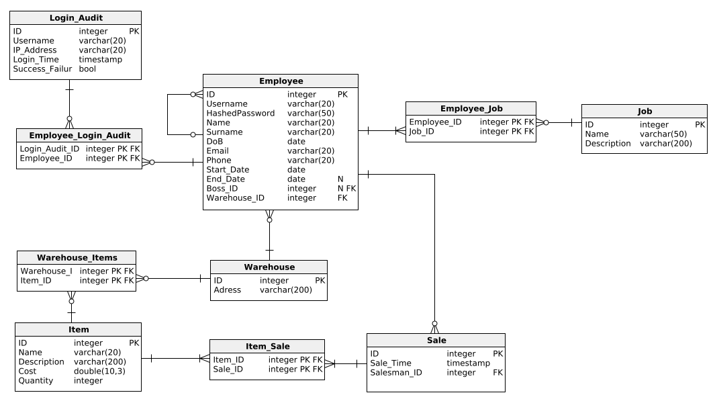
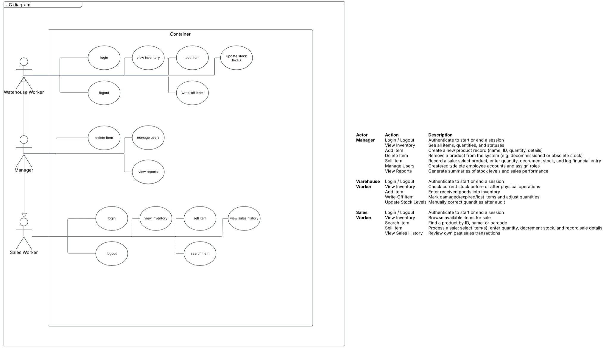
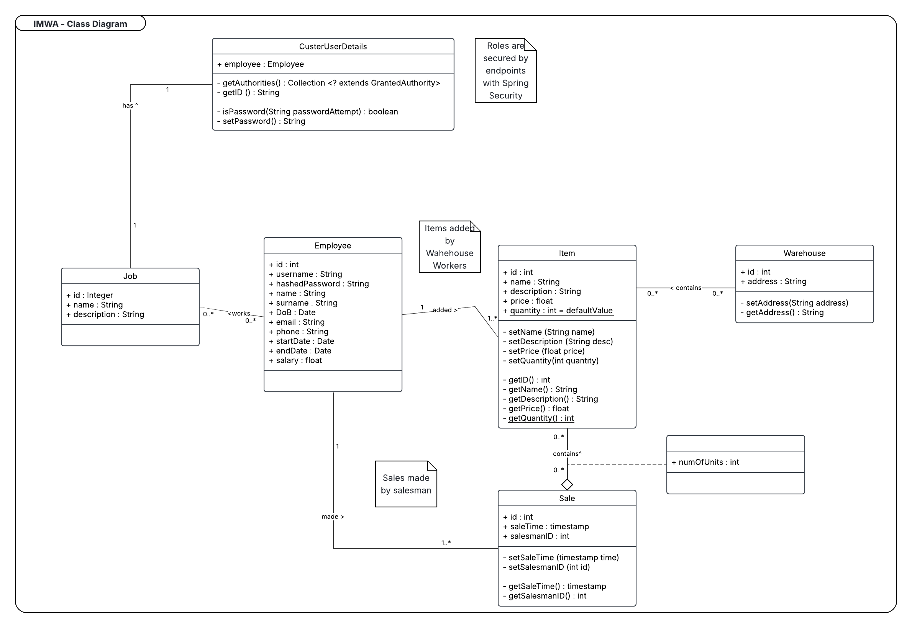

# 📦 Inventory Management Web App – Vortex Solution

A web-based inventory management system built to streamline warehouse operations and sales tracking. This project serves as a proof-of-concept (POC) with plans for future integration of barcode scanning and POS systems.

---

## Project Goals & Vision

### Version 1: Proof of Concept (Current)
- Add, remove, or sell items from inventory via web interface.

### Version 2: Barcode Integration
- Automatically generate unique barcode IDs for new items.
- Print barcodes for tagging products.

### Version 3: Barcode Scanning
- Use USB barcode scanner to retrieve item info.
- Update inventory and finance tables upon sales or removal.

### Version 4: Enterprise POS Integration *(Future Goal)*
- Integrate with POS systems to process payments.
- Automatically reduce inventory and record sales upon payment success.

---

## Contributing
To contribute, please follow the steps below to ensure a smooth and successful submission

1. **Fork the Repository**
Create a personal copy of the repository:
- Click the "Fork" button in the top-right corner of the repository on GitHub
- This will create a copy under your own GitHub account

2. **Clone Your Forker**
Clone the forked repository to your local machine:
    ```bash
    git clone https://github.com/your-username/your-forked-repo.github
    cd your-forked-repo
    ```

3. **Create a New Branch**
Create a new branch to isolate your changes. Use a descriptive branch name:
    ```bash
    git checkout -b feature/short-description
    ```
> **Tip:** Avoid making changes on the main branch

4. **Make Your Changes**
- Make your edits or additions to the codebase
- Ensure your code is **formatted properly** and follows standard style guides
- **Write test**, if applicable, for any new functionality
- Verify everything works correctly before commiting

5. **Commit Your Changes**
Use clear, descriptive commit messages
    ```bash
    git add .
    git commit -m "Add: implemented feature XYZ"
    ```
6. **Push to Your Fork**
Push changes to your forked repository:
    ```bash
    git push origin feature/short-description
    ```

7. **Open a Pull Request (PR)**
- Go to the original repository on GitHub
- Click "Compare & Pull Request" next to your recently pushed branch
- Provide a clear **title** and **description** explaining:
    - What the change does
    - Any relevant issue numbers (e.g., API #123)
- Submit the pull request for review

8. **Respond to Review Feedback**
- Be responsive to any comments or change requests from the maintainers
- Push follow-up commits to the same branch; the PR will update automatically

---

## Prerequisites

- **Java** 17 or higher  
- **Gradle** (Wrapper included)  
- **PostgreSQL** or **MySQL** (Database setup required)

---

## Installation

1. **Clone the Repository**
   ```bash
   git clone https://github.com/darknbolt/inventory-management-web-app.git
   cd inventory-management-web-app
   ```
   
2. **Build the Application**
    ```bash
    ./gradlew build
    ```
    
3. **Run the App**
    ```bash
    ./gradlew bootRun
    ```
    and access locally

---

## System Users

| Role              | Responsibilities                                                                 |
|-------------------|------------------------------------------------------------------------------------|
| Salesman          | Sell items, view sales history                                                     |
| Warehouse Worker  | Add/write-off/update items                                                        |
| Manager           | Full access, including user and report management                                  |

---

## Technology Stack

| Layer       | Technology                                        |
|-------------|---------------------------------------------------|
| Frontend    | HTML, CSS, Bootstrap 5, JavaScript                |
| Templating  | Thymeleaf (Server-side rendering)                 |
| Backend     | Java Spring Boot (MVC)                            |
| Security    | Spring Security with JWT, Email Verification      |
| ORM         | Spring Data JPA (Hibernate)                       |
| Database    | PostgreSQL / MySQL                                |
| Testing     | JUnit, Mockito, Spring Test                       |

---

## Core Functionalities

### Common to All Users
- Login / Logout
- View Inventory

### Warehouse Worker
- Add Item
- Write-off (damaged/lost)
- Manual Stock Adjustments

### Salesman
- Sell Item
- Search by ID/Name/Barcode
- View Own Sales History

### Manager
- Full Inventory Control
- User Management (CRUD)
- Sales & Inventory Reports
- Export to Google Sheets (optional)
- Dashboard with charts/statistics (optional)

---

## API Endpoints

### Authentication
| Method | Endpoint            | Description        |
|--------|---------------------|--------------------|
| POST   | `/api/auth/login`   | Authenticate user  |
| POST   | `/api/auth/logout`  | Logout and revoke token |

### Inventory Items
| Method | Endpoint                 | Description                   |
|--------|--------------------------|-------------------------------|
| GET    | `/api/items`             | List all items (filterable)   |
| GET    | `/api/items/{id}`        | Get item details              |
| POST   | `/api/items`             | Create new item               |
| PUT    | `/api/items/{id}`        | Update item                   |
| DELETE | `/api/items/{id}`        | Delete item                   |

### Stock Adjustments
| Method | Endpoint                         | Description                      |
|--------|----------------------------------|----------------------------------|
| POST   | `/api/items/{id}/adjust`         | Adjust stock (delta & reason)    |
| POST   | `/api/items/{id}/write-off`      | Write-off item                   |

### Sales
| Method | Endpoint             | Description                     |
|--------|----------------------|---------------------------------|
| GET    | `/api/sales`         | List sales (filterable)         |
| GET    | `/api/sales/{id}`    | Sale details                    |
| POST   | `/api/sales`         | Record sale                     |

### Users
| Method | Endpoint             | Description                     |
|--------|----------------------|---------------------------------|
| GET    | `/api/users`         | List users                      |
| GET    | `/api/users/{id}`    | Get user profile                |
| POST   | `/api/users`         | Create user                     |
| PUT    | `/api/users/{id}`    | Update user                     |
| DELETE | `/api/users/{id}`    | Delete user                     |

### Reports
| Method | Endpoint                        | Description                   |
|--------|----------------------------------|-------------------------------|
| GET    | `/api/reports/inventory`        | View stock levels             |
| GET    | `/api/reports/sales`            | Sales report by date          |

---

### Diagrams

- Entity Relationship Diagram

- Use Case Diagram

- Class Diagram


---

## Database Schema (SQL)

> Full SQL setup for PostgreSQL or MySQL is available under `/sql/schema.sql`.

### Sample Tables:
- **Employee**
- **Item**
- **Sale**
- **Warehouse**
- **Employee_Job**
- **Item_Sale**
- **Warehouse_Items**

### Notes:
- Proper **foreign keys** for relational integrity
- Includes `ALTER` and `DROP` scripts for migration handling

---

## Optional Features (Planned/Future)
- Dashboard with KPIs and charts
- Barcode printing and scanning
- POS integration
- Google Sheets export
- Enhanced role permissions

---
